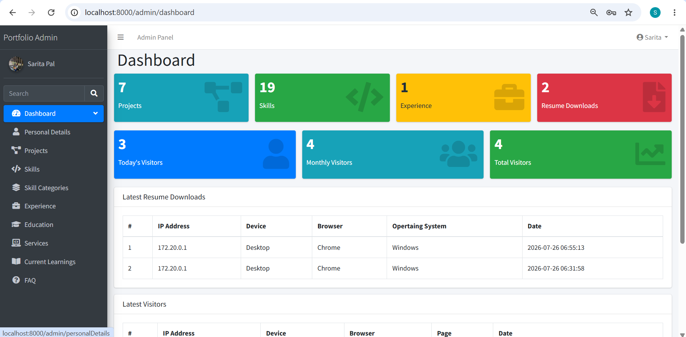

# Laravel 12 Portfolio Application

A dynamic portfolio website built using Laravel 12 with an admin dashboard for managing projects, skills, experience, education, FAQ, and resume information.

The application is containerized using Docker Compose with PHP-FPM, Nginx, and MySQL services.
---

## 🚀 Features

### Public Website

- Responsive portfolio website
- Dynamic project showcase
- Skills display
- Experience timeline
- Education details
- FAQ section
- Contact section
- Resume download
- SEO optimization
- Dynamic content management

### Admin Dashboard

- Admin authentication
- Manage projects
- Manage skills
- Manage experience
- Manage education
- Manage personal information
- Manage FAQ
- Upload project images
- Resume upload management
- Visitor tracking
- Dashboard statistics

---

# 🛠 Technology Stack

## Backend

- PHP 8.2
- Laravel 12
- Laravel Blade

## Frontend

- HTML5
- CSS3
- Bootstrap
- JavaScript
- jQuery

## Database

- MySQL 8

## Tools

- Composer
- Node.js
- npm
- Git
- GitHub

## DevOps

- Docker
- Docker Compose
- Nginx
- PHP-FPM

## Planned Deployment

- GitHub Actions
- AWS EC2
- HTTPS
---

# 🐳 Docker Setup

The application is fully containerized using Docker Compose.

- **app** - PHP 8.2 FPM running the Laravel application
- **nginx** - Web server
- **mysql** - MySQL 8 database

---

## Environment Setup

```bash
cp .env.docker.example .env.docker
cp .env.mysql.example .env.mysql
```

Generate the Laravel application key:

```bash
docker compose exec app php artisan key:generate
```
---

# Project Structure

portfolio/
├── app/
├── bootstrap/
├── config/
├── database/
│   ├── factories/
│   ├── migrations/
│   └── seeders/
├── docker/
│   ├── mysql/
│   │   └── my.cnf
│   ├── nginx/
│   │   └── default.conf
│   └── php/
│       ├── opcache.ini
│       ├── php.ini
│       └── www.conf
├── public/
├── resources/
├── routes/
├── storage/
├── tests/
├── .dockerignore
├── .gitignore
├── compose.yaml
├── Dockerfile
├── composer.json
├── composer.lock
├── package.json
├── package-lock.json
└── README.md

---

# Running Application Using Docker

## Clone Repository

```bash
git clone <repository-url>
cd portfolio
```

## Build Docker Containers

```bash
docker compose build
```

## Start Containers

```bash
docker compose up -d
```

## Install Composer Dependencies

```bash
docker compose exec app composer install
```

## Run Database Migration

```bash
docker compose exec app php artisan migrate --seed
```

## Create Storage Link

```bash
docker compose exec app php artisan storage:link
```

## Open Application

```text
http://localhost
```
---

# Screenshots

## Portfolio Home Page


## Admin Dashboard




## Future Improvements

- GitHub Actions (CI/CD)
- AWS EC2 Deployment
- Domain & HTTPS

---

## Author

**Sarita Pal**

Full Stack PHP Developer

**Tech Stack**

- Laravel
- PHP
- MySQL
- Docker
- Git
- AWS

